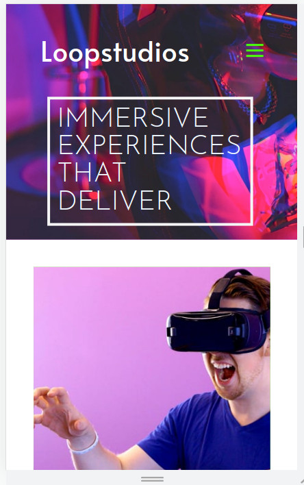
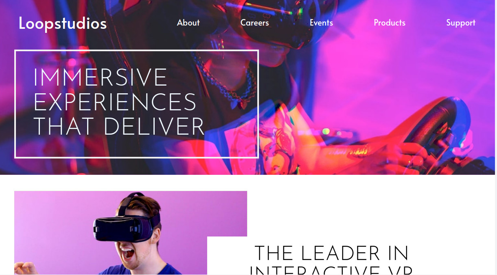

This is a solution to the [Loopstudios landing page challenge on Frontend Mentor](https://www.frontendmentor.io/challenges/loopstudios-landing-page-N88J5Onjw). Frontend Mentor challenges help you improve your coding skills by building realistic projects. 

*The challenge was to make Users should be able to:
        - View the optimal layout for the site depending on their device's screen size
        - See hover states for all interactive elements on the page

* Built with
    - Semantic HTML5 markup
    - CSS custom properties
    - Flexbox
    - CSS Grid
    - Mobile-first workflow
here it is the  screenshot and live link

- Live Site URL: [https://girma3.github.io/Loop-studios-landing-page/]

*In this project I learned much more about grid layout and to make responsive navigation menu for mobile.